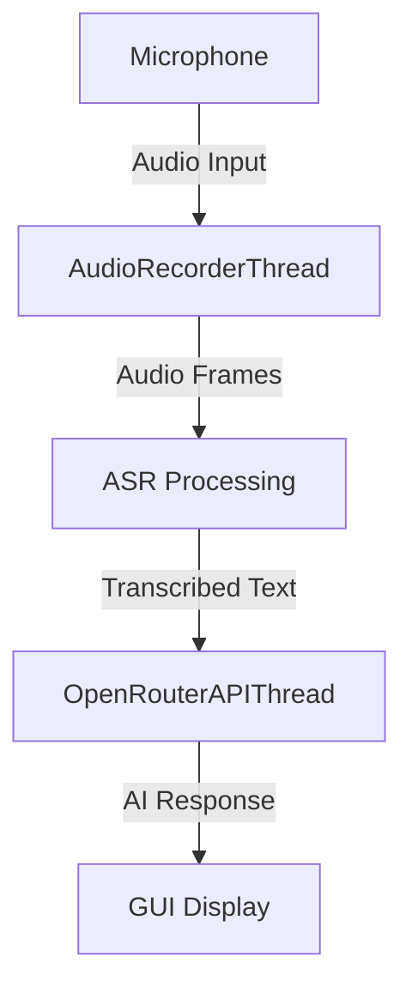

# Audio to Text Bot

A Python application that records audio input, transcribes speech to text using Hugging Face ASR models, and sends transcriptions to DeepSeek API via OpenRouter for AI responses.

## Features
- Real-time audio recording and transcription
- Hugging Face ASR model integration (AudioSangraha-Audio_to_Text)
- DeepSeek API integration via OpenRouter
- Sleek PyQt5 GUI with modern dark theme
- Multithreaded processing for responsive UI
- Error handling and status notifications

## Prerequisites
- Python 3.7+
- [OpenRouter API key](https://openrouter.ai/keys)
- Audio input device
- For Windows: [Microsoft Visual C++ Build Tools](https://visualstudio.microsoft.com/visual-cpp-build-tools/)
- For Linux: `sudo apt-get install portaudio19-dev`

## Installation
1. Clone repository:
```bash
git clone https://github.com/yourusername/audio-to-text-bot.git
cd audio-to-text-bot
```

2. Create virtual environment (recommended):
```bash
python -m venv venv
# Windows:
venv\Scripts\activate
# Linux/Mac:
source venv/bin/activate
```

3. Install dependencies:
```bash
pip install -r requirements.txt
```

## Configuration
Edit `audiotextbot.py` and set your OpenRouter API key:
```python
OPENROUTER_API_KEY = "your_api_key_here"  # Line 24
```

## Usage
```bash
python audiotextbot.py
```

### Application Workflow:
1. **Launch**: Application starts with dark theme interface
2. **Status Check**: ASR model loads automatically (may take 1-2 minutes)
3. **Recording**:
   - Click "Start Recording" to begin capture
   - Speak into your microphone
   - Transcriptions appear in real-time
4. **AI Processing**:
   - Transcriptions are sent to DeepSeek via OpenRouter
   - Responses appear in the bottom text area
5. **Stop**: Click "Stop Recording" to end capture

### GUI Overview:

1. Status panel - Shows application state and errors
2. Control buttons - Start/Stop recording
3. Transcription area - Displays speech-to-text results
4. Response area - Shows AI-generated responses

## Architecture


### Components:
1. **AudioRecorderThread**: Captures audio in real-time using sounddevice
2. **AudioSangraha ASR**: Speech-to-text model from Hugging Face
3. **OpenRouterAPIThread**: Sends text to DeepSeek API
4. **AudioToTextBot**: PyQt5 GUI controller with dark theme

## Troubleshooting
### Installation Issues
**Windows:**
```bash
# Install build tools if encountering C++ errors
winget install Microsoft.VisualStudio.2022.BuildTools
```

**Linux:**
```bash
# Install audio dependencies
sudo apt-get install portaudio19-dev python3-dev
```

### Audio Input Problems
1. Check microphone permissions
2. Verify default audio device:
```python
# Uncomment line 331 in audiotextbot.py:
print(sd.query_devices())
```
3. Ensure no other applications are using the microphone

### Model Loading Errors
- Check internet connection
- Verify Hugging Face model availability
- Try clearing cache: `rm -r ~/.cache/huggingface`

### API Errors
- Confirm OpenRouter API key is valid
- Check account balance on OpenRouter
- Verify DeepSeek model availability: `deepseek/deepseek-chat`

### Common Fixes
```bash
# Update pip and retry installation
pip install --upgrade pip
pip install -r requirements.txt

# Clear PyQt5 cache
rm -r __pycache__
```

## License
MIT License - Free for personal and commercial use

## Support
For additional help, open an issue on [GitHub](https://github.com/yourusername/audio-to-text-bot/issues)
