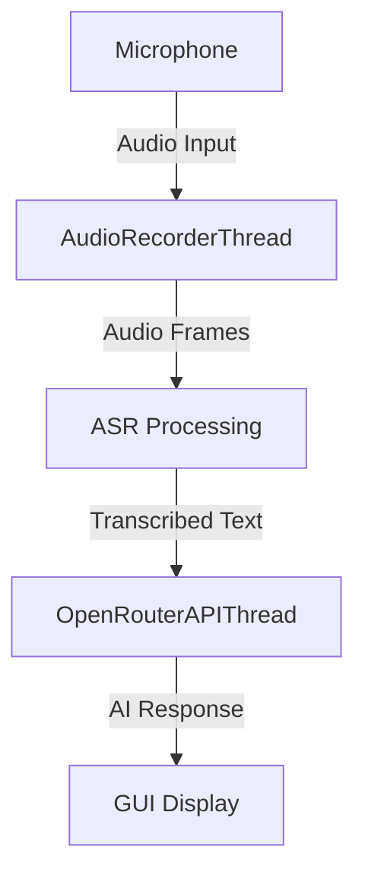

# Audio to Text Bot

A Python application that records audio input, transcribes speech to text using Hugging Face ASR models, and sends transcriptions to DeepSeek API via OpenRouter for AI responses.

## Features
- Real-time audio recording and transcription
- Hugging Face ASR model integration (AudioSangraha-Audio_to_Text)
- DeepSeek API integration via OpenRouter
- Simple PyQt5 GUI interface
- Multithreaded processing for responsive UI

## Prerequisites
- Python 3.7+
- [OpenRouter API key](https://openrouter.ai/keys)
- Audio input device

## Installation
1. Clone repository:
```bash
git clone https://github.com/yourusername/audio-to-text-bot.git
cd audio-to-text-bot
```

2. Create virtual environment:
```bash
python -m venv venv
source venv/bin/activate  # Linux/Mac
venv\Scripts\activate     # Windows
```

3. Install dependencies:
```bash
pip install -r requirements.txt
```

## Configuration
Edit `audiotextbot.py` and set your OpenRouter API key:
```python
OPENROUTER_API_KEY = "your_api_key_here"  # Line 18
```

## Usage
```bash
python audiotextbot.py
```

### GUI Controls:
- **Start Recording**: Begins audio capture
- **Stop Recording**: Ends audio capture
- Transcription appears in top text area
- DeepSeek responses appear in bottom text area

## Architecture


### Components:
1. **AudioRecorderThread**: Captures audio in real-time
2. **AudioSangraha ASR**: Speech-to-text model (Hugging Face)
3. **OpenRouterAPIThread**: Sends text to DeepSeek API
4. **AudioToTextBot**: PyQt5 GUI controller

## Troubleshooting
**No audio input detected:**
- Check microphone permissions
- Verify audio device selection:
  ```python
  print(sd.query_devices())  # Uncomment line 226
  ```

**Model loading errors:**
- Ensure internet connection for first-time model download
- Verify Hugging Face model availability

**API errors:**
- Check OpenRouter API key validity
- Confirm DeepSeek model availability: `deepseek/deepseek-chat`